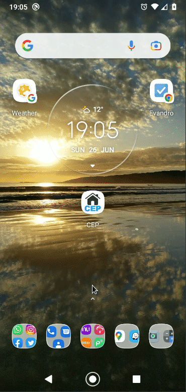

# :mailbox: Cep App

:iphone: Application android for search CEP.  
:mag_right: The search is done using the viacep API [click here](https://viacep.com.br/).

:arrow_down: <a href="https://github.com/evandroad/cep-app/raw/main/assets/cep-app_1.1.apk" download>Click to Download the app</a>

:camera: Scan to download the app

To clone the project with SSH:

    git clone git@github.com:evandroad/cep-app.git

To clone the project with HTTP:

    git clone https://github.com/evandroad/cep-app.git
